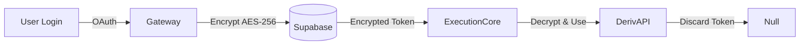
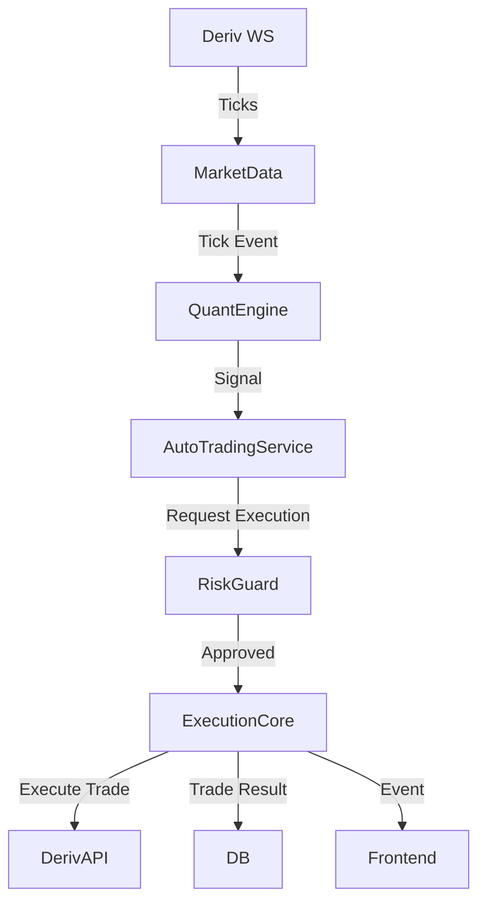

# Architecture

## Overview
TraderMind is an event-driven trading platform designed with a **Zero-Trust Architecture**. It enforces strict isolation between modules to ensure security and reliability.

## Core Modules

### 1. Frontend (`@tradermind/frontend`)
- **Role**: User Interface & Real-time Visualization.
- **Tech**: React 18, Vite, Zustand, Socket.IO Client.
- **Responsibility**: 
    - Authenticates users via Deriv OAuth.
    - Displays live market data, trade feeds, and session analytics.
    - Connects to API Gateway via WebSocket for real-time updates.
- **Zero-Trust Boundary**:
    - **NEVER** touches raw API tokens.
    - **NEVER** executes trades directly (always requests via Gateway).
    - **NEVER** reads from the database directly.

### 2. API Gateway (`@tradermind/api-gateway`)
- **Role**: Central Orchestration & Security Layer.
- **Tech**: Node.js, Express, Socket.IO Server, Redis.
- **Responsibility**:
    - Manage Authentication & Session State.
    - Proxy WebSocket events between internal services and the Frontend.
    - Execute the **Trading Loop** (Market Data → Signal → Risk → Execution).
    - Rate limiting and input validation.
- **Zero-Trust Boundary**:
    - Only module allowed to decrypt API tokens for brief execution windows.
    - Sanitizes all inputs before processing.

### 3. QuantEngine
- **Role**: Signal Generation.
- **Tech**: TypeScript (internal service).
- **Responsibility**:
    - Consumes market ticks.
    - Calculates technical indicators (RSI, EMA, etc.).
    - Emits `SIGNAL` events based on strategy logic.
- **Zero-Trust Boundary**:
    - Pure logic component; has **NO** access to user data or tokens.
    - Output is strictly "suggestions" (Signals) which must pass RiskGuard.

### 4. Database & Cache
- **Supabase (PostgreSQL)**:
    - Stores persistent data: Users, Sessions, Trades (Audit Log).
    - Protected by Row-Level Security (RLS).
- **Redis**:
    - Stores ephemeral state: Active sessions, live market cache, deduplication keys.

## Data Flow

### 1. Token Security Flow

### 2. Trading Loop Flow

## Security Principles
1. **Least Privilege**: Modules only access what they strictly need.
2. **Input Validation**: All external inputs (REST/WS) are validated against Zod schemas.
3. **Immutable Audit**: All executed trades are permanently recorded in Supabase.
