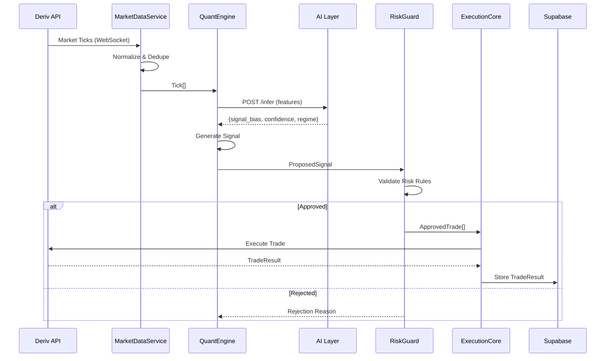

# TraderMind System Architecture

## System Overview

```mermaid
flowchart TB
    subgraph Client["Frontend (React + TypeScript)"]
        UI[User Interface]
        WS_CLIENT[WebSocket Client]
    end

    subgraph Gateway["API Gateway (Express + Socket.IO)"]
        AUTH[Auth Middleware]
        ROUTER[Route Handler]
        WS_SERVER[WebSocket Server]
    end

    subgraph Core["TraderMind Core (Node.js)"]
        MDS[MarketDataService]
        QE[QuantEngine]
        RG[RiskGuard]
        EC[ExecutionCore]
    end

    subgraph AI["Quant Intelligence Layer (Python)"]
        FASTAPI[FastAPI Server]
        ML[ML Models]
    end

    subgraph Data["Data Layer"]
        REDIS[(Redis - SessionRegistry)]
        SUPABASE[(Supabase - Postgres)]
    end

    subgraph External["External"]
        DERIV[Deriv WebSocket API]
    end

    UI --> WS_CLIENT
    WS_CLIENT <-->|WebSocket| WS_SERVER
    UI -->|HTTPS| AUTH
    AUTH --> ROUTER

    DERIV -->|Market Ticks| MDS
    MDS -->|Tick[]| QE
    QE -->|Signal| RG
    RG -->|ApprovedTrade| EC
    EC -->|Trade Request| DERIV

    QE <-->|REST POST /infer| FASTAPI
    FASTAPI --> ML

    QE --> REDIS
    RG --> REDIS
    EC --> SUPABASE
    AUTH --> SUPABASE
```

---

## Data Flow Pipeline



---

## Module Ownership

| Module | Responsibility | Reads | Writes | NEVER Touches |
|--------|---------------|-------|--------|---------------|
| **Frontend** | UI, user interactions | Session state via WS | User actions | Tokens, execution logic |
| **API Gateway** | Auth, routing, WS proxy | Auth tokens (encrypted) | Session events | Direct DB writes |
| **MarketDataService** | Tick ingestion | Deriv WS | Redis (tick cache) | User data, tokens |
| **QuantEngine** | Signal generation | Ticks, AI inference | Signals to RiskGuard | Tokens, balances |
| **RiskGuard** | Risk validation | User limits, session config | Approved/rejected signals | Token decryption |
| **ExecutionCore** | Trade execution | Approved trades | Supabase (trades) | Signal generation |
| **AI Layer** | ML inference | Numeric features only | Nothing | Tokens, balances, sessions, DB |
| **SessionRegistry** | Session state | Redis | Redis | Execution, tokens |

---

## Security Boundaries

```mermaid
flowchart LR
    subgraph FORBIDDEN["🔒 AI Layer NEVER Accesses"]
        T[Deriv Tokens]
        B[User Balances]
        S[Session State]
        E[Execution Paths]
        DB[Database]
    end

    subgraph ALLOWED["✓ AI Layer CAN Access"]
        F[Numeric Features]
        R[Return: signal_bias, confidence, regime]
    end

    AI[AI Layer] --> ALLOWED
    AI -.->|BLOCKED| FORBIDDEN
```



### Token Flow
```
User Login → OAuth Token → AES-256-GCM Encrypt → Supabase
                                    ↓
ExecutionCore (only) → Decrypt → Deriv API → Immediate Discard
```

---

## Failure Isolation Rules

| Scenario | System Behavior | Recovery |
|----------|-----------------|----------|
| **Backend Restart** | SessionRegistry rebuilds from Redis | Automatic |
| **AI Layer Unavailable** | Signals continue (rule-only mode) | Graceful degradation |
| **AI Latency > 100ms** | Signal dropped, use rules only | Timeout fallback |
| **Market WS Disconnect** | All sessions auto-paused | Reconnect + resume |
| **Execution Timeout** | User marked FAILED, session continues | Per-user isolation |
| **Duplicate WS Ticks** | Deduplicated by timestamp hash | Automatic |
| **Replay Attack** | Rejected by idempotency key | SR-003 compliance |

---

## Communication Protocols

| Path | Protocol | Format |
|------|----------|--------|
| Frontend ↔ API Gateway | HTTPS + WebSocket (Socket.IO) | JSON |
| API Gateway ↔ Core Services | Node EventEmitter | TypeScript objects |
| QuantEngine ↔ AI Layer | REST (HTTP POST) | JSON |
| Core ↔ Redis | Redis Protocol | Key-Value |
| Core ↔ Supabase | PostgreSQL + REST | SQL / JSON |
| Core ↔ Deriv | WebSocket | JSON |

---

## Folder to Module Mapping

```
/apps
  /frontend        → React UI (useTradingSession, useMarketStream hooks)
  /api-gateway     → Express + Socket.IO (Auth, Routing, WS Proxy)
  /quant-engine    → MarketDataService, QuantEngine, RiskGuard, ExecutionCore
  /ai-layer        → Python FastAPI (ML inference only)

/packages
  /schemas         → Shared types, Zod validators
  /shared-utils    → Idempotency, hashing utilities
  /risk-rules      → Risk validation logic
```
