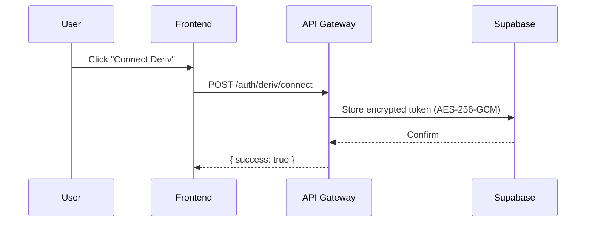
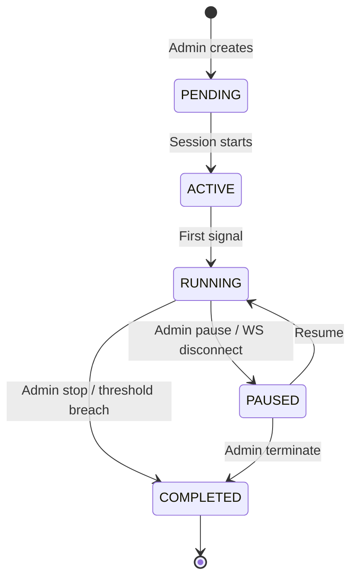

# TraderMind Week 2 Development Plan

## Overview
Week 2 focuses on implementing core authentication, session lifecycle management, and Redis integration.

## Day 8-9: Authentication

### OAuth Token Flow


### Tasks
- [ ] Implement Deriv OAuth redirect flow
- [ ] Token encryption service (AES-256-GCM)
- [ ] Supabase profiles table schema
- [ ] JWT session tokens
- [ ] Role-based access control (user/admin)

### Files to Create
- `apps/api-gateway/src/services/auth.ts`
- `apps/api-gateway/src/services/encryption.ts`
- `apps/api-gateway/src/routes/auth.ts`
- `apps/api-gateway/src/middleware/requireAuth.ts`

---

## Day 10-11: Session Lifecycle

### Session State Machine


### Tasks
- [ ] Session CRUD routes
- [ ] SessionRegistry (Redis-backed)
- [ ] Participant join/leave logic
- [ ] Session config validation
- [ ] Kill switch implementation

### Files to Create
- `apps/quant-engine/src/services/SessionRegistry.ts`
- `apps/quant-engine/src/services/SessionManager.ts`
- `apps/api-gateway/src/routes/sessions.ts`

---

## Day 12-13: Redis Integration

### Data Structures
```
tradermind:sessions:{id}           → Session JSON
tradermind:sessions:{id}:participants → Set of user IDs
tradermind:users:{id}:sessions    → Set of session IDs
tradermind:ticks:{market}         → Recent ticks (capped list)
tradermind:signals:pending        → Pending signals queue
```

### Tasks
- [ ] Redis connection pool
- [ ] Session persistence layer
- [ ] Tick cache with TTL
- [ ] Pub/Sub for real-time events
- [ ] Rebuild from Redis on restart

### Files to Create
- `apps/quant-engine/src/services/RedisClient.ts`
- `apps/quant-engine/src/services/TickCache.ts`

---

## Day 14: Integration Testing

### Test Scenarios
- [ ] User authentication flow
- [ ] Session create → join → start → stop
- [ ] WebSocket event delivery
- [ ] Redis persistence after restart
- [ ] Token encryption/decryption

---

## Dependencies

| Task | Depends On |
|------|------------|
| Session join | Auth complete |
| Trade execution | Session lifecycle |
| AI integration | Signal generation |
| Redis persistence | SessionRegistry |

## Success Criteria
- [ ] User can authenticate with Deriv
- [ ] Admin can create/manage sessions
- [ ] Users can join/leave sessions
- [ ] State persists across restarts
- [ ] All WebSocket events fire correctly
